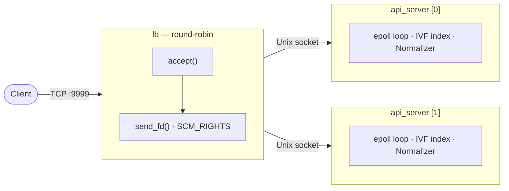
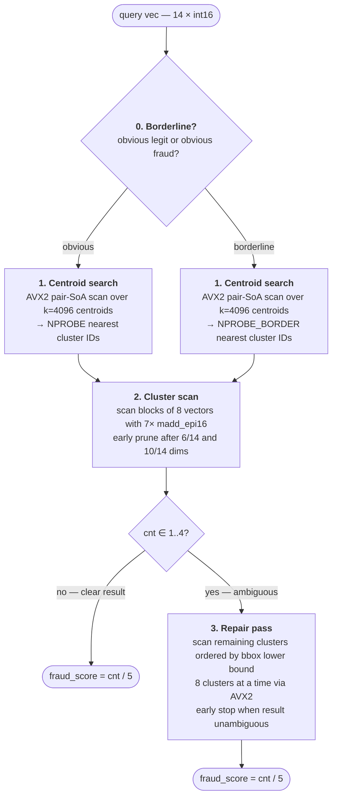
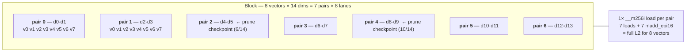

# Rinha de Backend — 2026

C++ service for the [Rinha de Backend 2026](https://github.com/zanfranceschi/rinha-de-backend-2026) event. The task: given a transaction request, compute a fraud score by finding the 5 nearest neighbors across a reference dataset and returning the ratio of fraudulent ones.

## Architecture

Two `api_server` instances sit behind a custom `lb` process. The load balancer accepts TCP connections and forwards them to backends via SCM_RIGHTS (passing the raw socket fd over a Unix domain socket), so each backend owns its connection directly — no proxy overhead.

Each `api_server` runs a single-threaded epoll loop. There are no worker threads, no locks, no queues. The IVF index and normalizer live in process memory; after startup the working set is locked with `mlockall` to avoid page faults under load.

## Algorithm: IVF with SIMD scan

The reference vectors are quantized to `int16` (scale ×10000, range `[-10000, 10000]`), grouped into blocks of 8, and stored in a pair-SoA layout (dimensions interleaved in pairs) so that 7 AVX2 `madd_epi16` instructions cover all 14 dimensions at once.

At query time:

0. **Borderline detection** — before probing, classify the transaction as *obvious* (clearly legit or clearly fraud) or *borderline*. Obvious transactions use the cheaper `NPROBE` probe count; borderline ones use the larger `NPROBE_BORDER`. A transaction is *obvious legit* if all hold: amount ≤ 500, amount/cust_avg ≤ 0.5, installments ≤ 3, tx_count_24h ≤ 5, km_home ≤ 50, safe MCC, known merchant. It is *obvious fraud* if all hold: amount ≥ 5000, installments ≥ 5, tx_count_24h ≥ 6, km_home ≥ 150, risky MCC, unknown merchant. Everything else is borderline (~21% of the test dataset).
1. **Centroid search** — find the nearest cluster centroids using AVX2 distance accumulation over a prebuilt pair-SoA centroid table. Query pairs (`vq`) are computed once and reused across all three phases.
2. **Cluster scan** — scan each selected cluster block-by-block with two partial prune checkpoints: after 6 of 14 dimensions and again after 10 of 14 dimensions, skip a block if all 8 lanes already exceed the current worst-of-top-5.
3. **Repair pass** — if the top-5 result is mixed (1–4 fraud out of 5), the initial probes may have missed the true neighborhood. A second pass scans all remaining clusters ordered by their bbox lower bound, computed 8 clusters at a time via SIMD. Clusters already probed are skipped via a bitset. Scanning stops early once the result becomes unambiguous.

### Block memory layout (pair-SoA)

Vectors are stored in groups of 8 with dimensions interleaved in pairs. One AVX2 register covers one pair across all 8 lanes — so 7 loads + 7 `madd_epi16` compute the full L2 distance for 8 vectors simultaneously.

Each pair row = one `__m256i` load (16 × int16). 7 rows × 16 × 2 bytes = **224 bytes per block**. Prune fires after pair 2 (6/14 dims) and pair 4 (10/14 dims).

### Calibration parameters

| Parameter | Value | Note |
|---|---|---|
| `k` (clusters) | 4096 | K-means cluster count used at build time |
| `NPROBE` | 1 | Clusters probed for obvious legit/fraud transactions |
| `NPROBE_BORDER` | 12 | Clusters probed for borderline transactions (~21% of load) |
| Quantization scale | ×10000 | int16, range ±10000 |
| Block size | 8 vectors | For AVX2 8-wide SIMD |
| Repair condition | cnt ∈ [1, 4] | Triggers full index scan when result is ambiguous |

With these settings the index achieves 6000/6000 recall (0 FP, 0 FN) at p99 ≈ 15 µs on the full test dataset (see [benchmark.md](benchmark.md) for full results).

## Feature normalization

14-dimensional feature vector per transaction:

| # | Feature | Normalization |
|---|---|---|
| 0 | amount | clamp(amount / max_amount) |
| 1 | installments | clamp(installments / max_installments) |
| 2 | amount_vs_avg | clamp((amount / cust_avg) / max_ratio) |
| 3 | hour_of_day | hour / 23 |
| 4 | day_of_week | weekday / 6 (Mon=0) |
| 5 | minutes_since_last_tx | clamp(diff_min / max_minutes), -1 if no prior tx |
| 6 | km_from_last_tx | clamp(km / max_km), -1 if no prior tx |
| 7 | km_from_home | clamp(km / max_km) |
| 8 | tx_count_24h | clamp(count / max_count) |
| 9 | is_online | 0 / 1 |
| 10 | card_present | 0 / 1 |
| 11 | unknown_merchant | 1 if merchant not in customer's known list |
| 12 | mcc_risk | lookup in mcc_risk.json, default 0.5 |
| 13 | merchant_avg_amount | clamp(merchant_avg / max_merchant_avg) |

Timestamp parsing and weekday computation are done inline without `timegm` or `mktime` — using Howard Hinnant's civil-to-epoch formula and Tomohiko Sakamoto's weekday algorithm.

Normalization constants (`max_amount`, `max_km`, etc.) are preloaded from `normalization.json` as reciprocals to replace divisions with multiplications at query time.

## Repository layout

- `src/converter.cpp` — reads `references.json[.gz]`, runs AVX2+OMP accelerated K-means (200k sample, top-2 assignment, balance pass), writes the binary IVF index
- `src/bench.cpp` — offline benchmark: normalize + `get_fraud_count` directly against the full test dataset, no HTTP overhead
- `src/server.cpp` — epoll HTTP server, parses requests, queries IVF, responds
- `src/lb.cpp` — round-robin load balancer using SCM_RIGHTS fd passing
- `src/ivf.hpp` — IVF index: layout, centroid SoA build, cluster scan, repair pass
- `src/normalizer.hpp` — feature extraction and quantization (custom zero-copy JSON parser)
- `src/apm.hpp` — optional APM: latency histograms, Prometheus metrics endpoint
- `src/flat_json.hpp` — minimal flat JSON key→float parser (used by normalizer at startup)
- `src/metrics_server.hpp` — background HTTP thread for Prometheus scrape
- `src/types.hpp` — shared binary format (IndexHeader, IndexLayout, constants)
- `resources/` — JSON inputs: `references.json[.gz]`, `mcc_risk.json`, `normalization.json`

## Build & Run

| Command | Description |
|---|---|
| `make build` | Build Docker images |
| `make run` | Build and start in background |
| `make run-apm` | Build and start with Prometheus + Grafana |
| `make down` | Stop all containers |
| `make prune` | Stop, remove images, volumes, and local build |
| `make bench` | Run offline benchmark against the full test dataset |
| `make k6` | Start server, run k6 load test with web dashboard, then stop |
| `make cmake` | Local build via cmake (for development) |
| `make convert` | Local build + convert `references.json` → `references.bin` |
| `make format` | Format source with clang-format |
| `make lint` | Lint source with clang-tidy |
| `make lint-fix` | Lint and auto-apply fixes with clang-tidy |
| `make install-deps` | Install build dependencies via apt |
| `make clean` | Remove local build directory |

Server configuration is via environment variables (see `docker-compose.yml`): `API_NPROBE`, `API_NPROBE_BORDER`, `API_REPAIR_MIN`, `API_REPAIR_MAX`, `API_BUSY_POLL_US`, `API_EPOLL_TIMEOUT_MS`.

## License

MIT — see [LICENSE](LICENSE).
