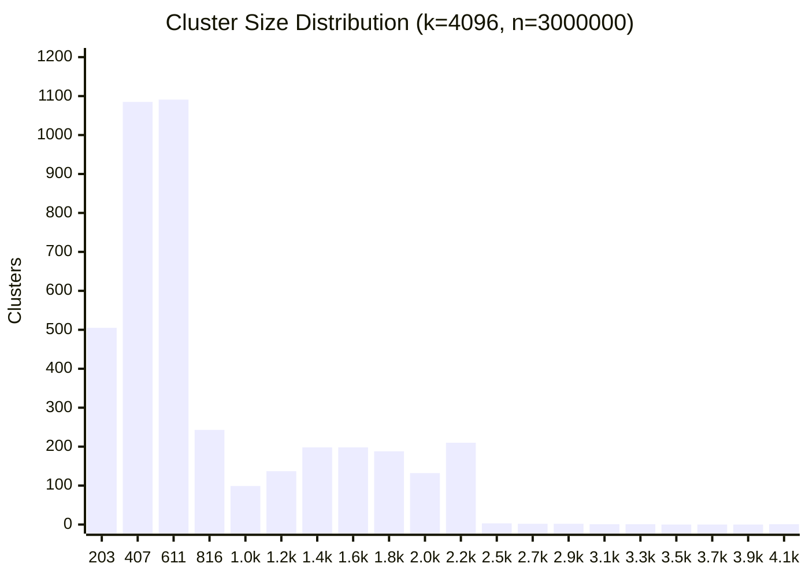

# Benchmark

Offline benchmark — normalize + `get_fraud_count` directly, no HTTP overhead, against all 54100 entries in the test dataset.

## Environment

| | |
|---|---|
| **CPU** | AMD Ryzen 7 7700X 8-Core Processor |
| **Cores / Threads** | 8 cores / 16 threads |
| **Max clock** | 5533 MHz |
| **L1d** | 32K |
| **L1i** | 32K |
| **L2**  | 1024K |
| **L3**  | 32768K |
| **Compiler** | GCC (Debian trixie-slim) |
| **Flags** | `-Ofast -march=haswell -mtune=haswell -flto` |
| **Pinned CPUs** | 0 |
| **CPU limit** | 0.37 cores (≈ Core i5-4260U @ 1.4 GHz single-thread) |

> Target hardware is a **Mac mini 2014 (Core i5-4260U, 1.4 GHz)**. The CPU throttle (0.37×) approximates its single-thread performance relative to this machine (~2.7× slower). Use these numbers to compare configs, not to predict absolute latency on the rinha.

## Dataset

| | |
|---|---|
| **Total** | 54100 |
| **Fraud** | 23959 (44.3%) |
| **Legit** | 30141 (55.7%) |
| **Edge cases** | 645 (1.2%) |

## Index

| | |
|---|---|
| **n** | 3000000 |
| **k** | 4096 |
| **train_sample** | 50000 |
| **train_iters** | 26 |

### Cluster size distribution

> min=11  max=4085  avg=732.4



## Results

> `approved = fraud_neighbors / 5 < 0.6` — threshold is fixed by the server.

| NPROBE | R.MIN | R.MAX | avg (µs) | p50 (µs) | p99 (µs) | max (µs) | TP | TN | FP | FN | FP% | FN% |
|---|---|---|---|---|---|---|---|---|---|---|---|---|
| 4 | — | — | 13.41 | 5.01 | 9.40 | 65603.1 | 23884 | 30042 | 99 | 75 | 0.18% | 0.14% |
| 8 | — | — | 21.94 | 7.72 | 14.64 | 65584.6 | 23944 | 30097 | 44 | 15 | 0.08% | 0.03% |
| 12 | — | — | 29.63 | 10.59 | 19.78 | 65795.2 | 23952 | 30124 | 17 | 7 | 0.03% | 0.01% |
| 16 | — | — | 36.91 | 13.18 | 25.22 | 65598.4 | 23953 | 30126 | 15 | 6 | 0.03% | 0.01% |
| 24 | — | — | 50.62 | 18.62 | 35.33 | 65739.7 | 23952 | 30130 | 11 | 7 | 0.02% | 0.01% |
| 32 | — | — | 70.28 | 25.00 | 48.32 | 65485.1 | 23952 | 30130 | 11 | 7 | 0.02% | 0.01% |
| 48 | — | — | 105.89 | 37.94 | 73.17 | 65651.4 | 23954 | 30135 | 6 | 5 | 0.01% | 0.01% |
| 64 | — | — | 151.35 | 52.22 | 110.81 | 65676.5 | 23956 | 30138 | 3 | 3 | 0.01% | 0.01% |
| 4 | 1 | 4 | 14.87 | 5.19 | 12.11 | 65290.2 | 23958 | 30132 | 9 | 1 | 0.02% | 0.00% |
| 8 | 1 | 4 | 24.07 | 8.45 | 17.08 | 65336.9 | 23959 | 30140 | 1 | 0 | 0.00% | 0.00% |
| **12** | **1** | **4** | **31.11** | **10.80** | **21.43** | **65332.9** | **23959** | **30141** | **0** | **0** | **0.00%** | **0.00%** |
| **16** | **1** | **4** | **37.16** | **12.98** | **28.36** | **65332.7** | **23959** | **30141** | **0** | **0** | **0.00%** | **0.00%** |
| **24** | **1** | **4** | **50.05** | **17.75** | **35.25** | **65618.0** | **23959** | **30141** | **0** | **0** | **0.00%** | **0.00%** |
| **32** | **1** | **4** | **68.97** | **24.88** | **47.37** | **65826.6** | **23959** | **30141** | **0** | **0** | **0.00%** | **0.00%** |
| 4 | 2 | 3 | 15.12 | 5.51 | 11.48 | 65570.7 | 23948 | 30117 | 24 | 11 | 0.04% | 0.02% |
| 8 | 2 | 3 | 23.94 | 8.46 | 16.47 | 65332.6 | 23956 | 30136 | 5 | 3 | 0.01% | 0.01% |
| 12 | 2 | 3 | 31.08 | 10.75 | 21.00 | 65322.6 | 23957 | 30138 | 3 | 2 | 0.01% | 0.00% |
| 16 | 2 | 3 | 37.05 | 13.27 | 25.34 | 65763.7 | 23957 | 30140 | 1 | 2 | 0.00% | 0.00% |
| 24 | 2 | 3 | 53.27 | 18.80 | 35.78 | 65617.4 | 23958 | 30140 | 1 | 1 | 0.00% | 0.00% |
| 32 | 2 | 3 | 69.98 | 24.81 | 47.29 | 65768.1 | 23958 | 30140 | 1 | 1 | 0.00% | 0.00% |

## Running

```bash
make bench
```

To pin different CPUs, edit `cpuset` in `bench/docker-compose.yml`.
