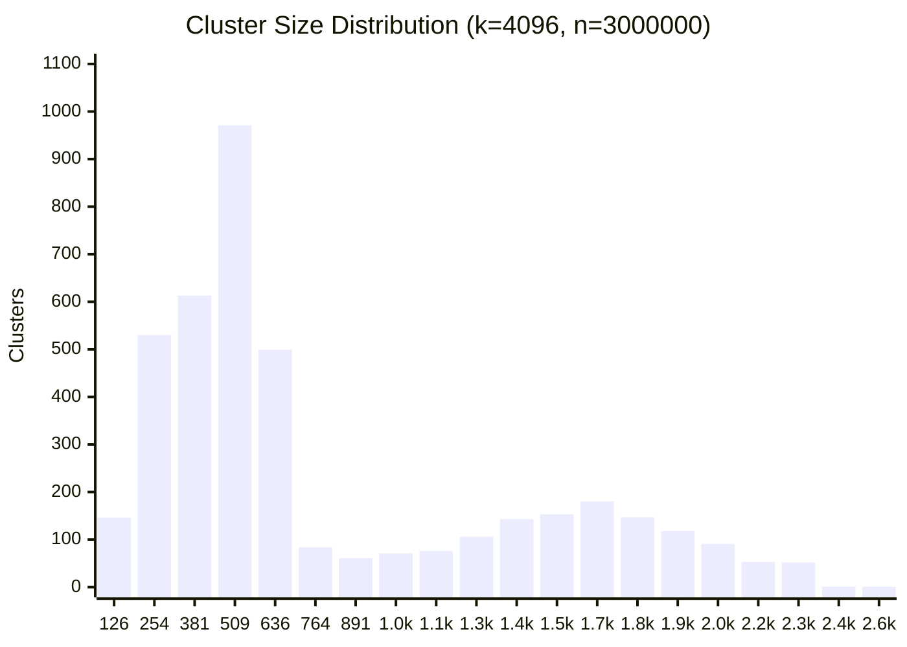

# Benchmark

Offline benchmark — normalize + `get_fraud_count` directly, no HTTP overhead, against all 54100 entries in the test dataset.

## Environment

| | |
|---|---|
| **CPU** | AMD Ryzen 7 7700X 8-Core Processor |
| **Cores / Threads** | 8 cores / 16 threads |
| **Max clock** | 5533 MHz |
| **L1d** | 32K |
| **L1i** | 32K |
| **L2**  | 1024K |
| **L3**  | 32768K |
| **Compiler** | GCC (Debian trixie-slim) |
| **Flags** | `-Ofast -march=haswell -mtune=haswell -flto` |
| **Pinned CPUs** | 0 |
| **CPU limit** | 0.37 cores (≈ Core i5-4260U @ 1.4 GHz single-thread) |

> Target hardware is a **Mac mini 2014 (Core i5-4260U, 1.4 GHz)**. The CPU throttle (0.37×) approximates its single-thread performance relative to this machine (~2.7× slower). Use these numbers to compare configs, not to predict absolute latency on the rinha.

## Dataset

| | |
|---|---|
| **Total** | 54100 |
| **Fraud** | 23959 (44.3%) |
| **Legit** | 30141 (55.7%) |
| **Edge cases** | 645 (1.2%) |

## Index

| | |
|---|---|
| **n** | 3000000 |
| **k** | 4096 |
| **train_sample** | 200000 |
| **train_iters** | 69/100 (converged) |

### Cluster size distribution

> min=13  max=2550  avg=732.4



## Results

> `approved = fraud_neighbors / 5 < 0.6` — threshold is fixed by the server.

| NPROBE | R.MIN | R.MAX | avg (µs) | p50 (µs) | p99 (µs) | max (µs) | TP | TN | FP | FN | FP% | FN% |
|---|---|---|---|---|---|---|---|---|---|---|---|---|
| 4 | — | — | 14.88 | 5.31 | 9.89 | 63845.7 | 23892 | 30050 | 91 | 67 | 0.17% | 0.12% |
| 8 | — | — | 21.75 | 7.46 | 14.41 | 63803.2 | 23938 | 30106 | 35 | 21 | 0.06% | 0.04% |
| 12 | — | — | 30.98 | 10.67 | 20.51 | 63891.1 | 23953 | 30118 | 23 | 6 | 0.04% | 0.01% |
| 16 | — | — | 37.15 | 13.33 | 25.38 | 63817.9 | 23957 | 30120 | 21 | 2 | 0.04% | 0.00% |
| 24 | — | — | 52.09 | 18.83 | 36.00 | 64026.3 | 23956 | 30127 | 14 | 3 | 0.03% | 0.01% |
| 32 | — | — | 68.83 | 24.87 | 47.16 | 63950.7 | 23955 | 30130 | 11 | 4 | 0.02% | 0.01% |
| 48 | — | — | 105.59 | 37.90 | 71.45 | 63946.4 | 23956 | 30135 | 6 | 3 | 0.01% | 0.01% |
| 64 | — | — | 148.10 | 52.84 | 99.23 | 64001.4 | 23957 | 30136 | 5 | 2 | 0.01% | 0.00% |
| 4 | 1 | 4 | 16.59 | 5.74 | 12.02 | 63910.2 | 23959 | 30134 | 7 | 0 | 0.01% | 0.00% |
| 8 | 1 | 4 | 22.51 | 8.12 | 16.34 | 63824.9 | 23959 | 30140 | 1 | 0 | 0.00% | 0.00% |
| **12** | **1** | **4** | **29.76** | **10.69** | **20.55** | **63869.3** | **23959** | **30141** | **0** | **0** | **0.00%** | **0.00%** |
| **16** | **1** | **4** | **38.19** | **13.23** | **25.27** | **63889.9** | **23959** | **30141** | **0** | **0** | **0.00%** | **0.00%** |
| **24** | **1** | **4** | **53.28** | **18.79** | **35.94** | **63920.1** | **23959** | **30141** | **0** | **0** | **0.00%** | **0.00%** |
| **32** | **1** | **4** | **70.11** | **24.84** | **47.41** | **64050.4** | **23959** | **30141** | **0** | **0** | **0.00%** | **0.00%** |
| 4 | 2 | 3 | 16.49 | 5.71 | 11.48 | 63628.0 | 23954 | 30121 | 20 | 5 | 0.04% | 0.01% |
| 8 | 2 | 3 | 23.55 | 8.05 | 15.47 | 63797.9 | 23958 | 30131 | 10 | 1 | 0.02% | 0.00% |
| 12 | 2 | 3 | 29.71 | 10.68 | 20.20 | 63943.6 | 23959 | 30136 | 5 | 0 | 0.01% | 0.00% |
| 16 | 2 | 3 | 37.05 | 13.25 | 25.11 | 63958.0 | 23959 | 30136 | 5 | 0 | 0.01% | 0.00% |
| 24 | 2 | 3 | 53.32 | 18.82 | 36.10 | 63944.5 | 23959 | 30139 | 2 | 0 | 0.00% | 0.00% |
| 32 | 2 | 3 | 71.61 | 25.07 | 48.82 | 63839.7 | 23959 | 30140 | 1 | 0 | 0.00% | 0.00% |

## Running

```bash
make bench
```

To pin different CPUs, edit `cpuset` in `bench/docker-compose.yml`.
