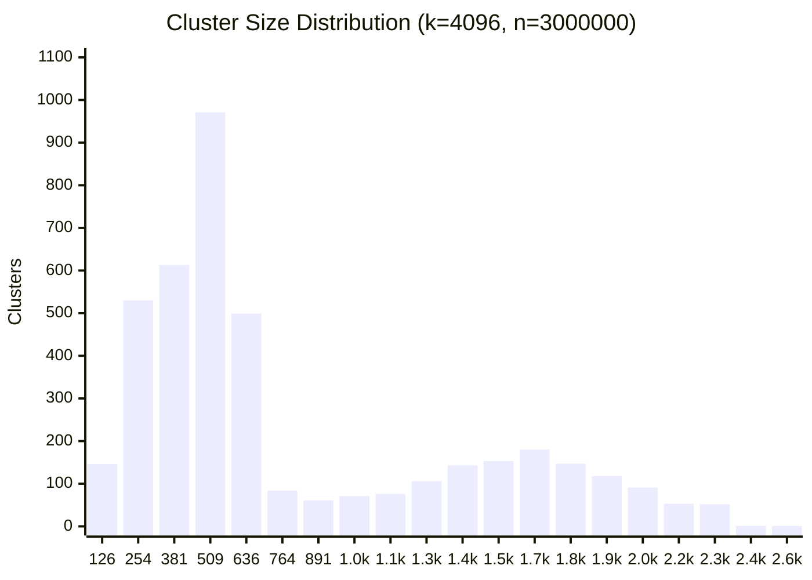

# Benchmark

Offline benchmark — normalize + `get_fraud_count` directly, no HTTP overhead, against all 54100 entries in the test dataset.

## Environment

| | |
|---|---|
| **CPU** | AMD Ryzen 7 7700X 8-Core Processor |
| **Cores / Threads** | 8 cores / 16 threads |
| **Max clock** | 5533 MHz |
| **L1d** | 32K |
| **L1i** | 32K |
| **L2**  | 1024K |
| **L3**  | 32768K |
| **Compiler** | GCC (Debian trixie-slim) |
| **Flags** | `-Ofast -march=haswell -mtune=haswell -flto` |
| **Pinned CPUs** | 0 |
| **CPU limit** | 0.37 cores (≈ Core i5-4260U @ 1.4 GHz single-thread) |

> Target hardware is a **Mac mini 2014 (Core i5-4260U, 1.4 GHz)**. The CPU throttle (0.37×) approximates its single-thread performance relative to this machine (~2.7× slower). Use these numbers to compare configs, not to predict absolute latency on the rinha.

## Dataset

| | |
|---|---|
| **Total** | 54100 |
| **Fraud** | 23959 (44.3%) |
| **Legit** | 30141 (55.7%) |
| **Edge cases** | 645 (1.2%) |
| **Borderline (detected)** | 11307 (20.9%) |

## Index

| | |
|---|---|
| **n** | 3000000 |
| **k** | 4096 |
| **train_sample** | 200000 |
| **train_iters** | 69/1000 (converged) |

### Cluster size distribution

> min=13  max=2550  avg=732.4



## Results

> `approved = fraud_neighbors / 5 < 0.6` — threshold is fixed by the server.

| NP | NP.BORDER | R.MIN | R.MAX | avg (µs) | p50 (µs) | p99 (µs) | max (µs) | TP | TN | FP | FN | FP% | FN% |
|---|---|---|---|---|---|---|---|---|---|---|---|---|---|
| 8 | — | 1 | 4 | 20.73 | 7.53 | 15.24 | 65621.0 | 23959 | 30140 | 1 | 0 | 0.00% | 0.00% |
| 10 | — | 1 | 4 | 25.84 | 9.11 | 17.71 | 65882.5 | 23959 | 30140 | 1 | 0 | 0.00% | 0.00% |
| **12** | **—** | **1** | **4** | **29.79** | **10.71** | **20.70** | **65490.3** | **23959** | **30141** | **0** | **0** | **0.00%** | **0.00%** |
| <span style="color:limegreen">**1**</span> | <span style="color:limegreen">**12**</span> | <span style="color:limegreen">**1**</span> | <span style="color:limegreen">**4**</span> | <span style="color:limegreen">**12.98**</span> | <span style="color:limegreen">**4.03**</span> | <span style="color:limegreen">**15.34**</span> | <span style="color:limegreen">**65780.6**</span> | <span style="color:limegreen">**23959**</span> | <span style="color:limegreen">**30141**</span> | <span style="color:limegreen">**0**</span> | <span style="color:limegreen">**0**</span> | <span style="color:limegreen">**0.00%**</span> | <span style="color:limegreen">**0.00%**</span> |
| **2** | **12** | **1** | **4** | **14.94** | **4.89** | **15.43** | **65755.0** | **23959** | **30141** | **0** | **0** | **0.00%** | **0.00%** |
| **3** | **12** | **1** | **4** | **16.80** | **5.64** | **15.87** | **65728.3** | **23959** | **30141** | **0** | **0** | **0.00%** | **0.00%** |
| **4** | **12** | **1** | **4** | **19.73** | **6.36** | **16.08** | **65748.0** | **23959** | **30141** | **0** | **0** | **0.00%** | **0.00%** |
| **5** | **12** | **1** | **4** | **20.25** | **6.98** | **15.97** | **65832.7** | **23959** | **30141** | **0** | **0** | **0.00%** | **0.00%** |
| **6** | **12** | **1** | **4** | **22.00** | **7.66** | **16.52** | **65750.5** | **23959** | **30141** | **0** | **0** | **0.00%** | **0.00%** |
| **7** | **12** | **1** | **4** | **23.60** | **8.13** | **16.90** | **65785.7** | **23959** | **30141** | **0** | **0** | **0.00%** | **0.00%** |
| **8** | **12** | **1** | **4** | **25.39** | **8.69** | **17.77** | **65844.8** | **23959** | **30141** | **0** | **0** | **0.00%** | **0.00%** |
| **9** | **12** | **1** | **4** | **25.94** | **9.21** | **18.23** | **65830.0** | **23959** | **30141** | **0** | **0** | **0.00%** | **0.00%** |
| **10** | **12** | **1** | **4** | **26.43** | **9.70** | **18.70** | **65747.7** | **23959** | **30141** | **0** | **0** | **0.00%** | **0.00%** |
| **11** | **12** | **1** | **4** | **29.50** | **10.35** | **20.52** | **65946.5** | **23959** | **30141** | **0** | **0** | **0.00%** | **0.00%** |

## Running

```bash
make bench
```

To pin different CPUs, edit `cpuset` in `bench/docker-compose.yml`.
