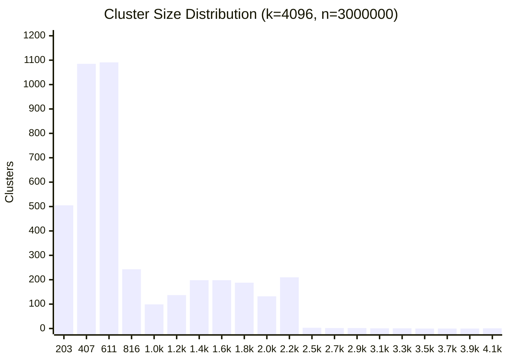

# Benchmark

Offline benchmark — normalize + `get_fraud_count` directly, no HTTP overhead, against all 54100 entries in the test dataset.

## Environment

| | |
|---|---|
| **CPU** | AMD Ryzen 7 7700X 8-Core Processor |
| **Cores / Threads** | 8 cores / 16 threads |
| **Max clock** | 5533 MHz |
| **L1d** | 32K |
| **L1i** | 32K |
| **L2**  | 1024K |
| **L3**  | 32768K |
| **Compiler** | GCC (Debian trixie-slim) |
| **Flags** | `-Ofast -march=haswell -mtune=haswell -flto` |
| **Pinned CPUs** | 0 |
| **CPU limit** | 0.37 cores (≈ Core i5-4260U @ 1.4 GHz single-thread) |

> Target hardware is a **Mac mini 2014 (Core i5-4260U, 1.4 GHz)**. The CPU throttle (0.37×) approximates its single-thread performance relative to this machine (~2.7× slower). Use these numbers to compare configs, not to predict absolute latency on the rinha.

## Dataset

| | |
|---|---|
| **Total** | 54100 |
| **Fraud** | 23959 (44.3%) |
| **Legit** | 30141 (55.7%) |
| **Edge cases** | 645 (1.2%) |

## Index

| | |
|---|---|
| **n** | 3000000 |
| **k** | 4096 |
| **train_sample** | 50000 |
| **train_iters** | 26/1000 (converged) |

### Cluster size distribution

> min=11  max=4085  avg=732.4



## Results

> `approved = fraud_neighbors / 5 < 0.6` — threshold is fixed by the server.

| NPROBE | R.MIN | R.MAX | avg (µs) | p50 (µs) | p99 (µs) | max (µs) | TP | TN | FP | FN | FP% | FN% |
|---|---|---|---|---|---|---|---|---|---|---|---|---|
| 1 | 1 | 4 | 18.59 | 6.61 | 13.88 | 63539.3 | 23947 | 30098 | 43 | 12 | 0.08% | 0.02% |
| 2 | 1 | 4 | 22.18 | 7.79 | 15.52 | 63655.9 | 23957 | 30118 | 23 | 2 | 0.04% | 0.00% |
| 4 | 1 | 4 | 27.53 | 9.57 | 18.09 | 63849.1 | 23958 | 30132 | 9 | 1 | 0.02% | 0.00% |
| 8 | 1 | 4 | 34.84 | 12.21 | 22.21 | 63576.8 | 23959 | 30140 | 1 | 0 | 0.00% | 0.00% |
| <span style="color:limegreen">**12**</span> | <span style="color:limegreen">**1**</span> | <span style="color:limegreen">**4**</span> | <span style="color:limegreen">**42.27**</span> | <span style="color:limegreen">**14.94**</span> | <span style="color:limegreen">**26.57**</span> | <span style="color:limegreen">**63682.8**</span> | <span style="color:limegreen">**23959**</span> | <span style="color:limegreen">**30141**</span> | <span style="color:limegreen">**0**</span> | <span style="color:limegreen">**0**</span> | <span style="color:limegreen">**0.00%**</span> | <span style="color:limegreen">**0.00%**</span> |
| **16** | **1** | **4** | **48.36** | **17.43** | **31.19** | **63680.5** | **23959** | **30141** | **0** | **0** | **0.00%** | **0.00%** |
| **24** | **1** | **4** | **64.69** | **23.09** | **41.84** | **63740.6** | **23959** | **30141** | **0** | **0** | **0.00%** | **0.00%** |
| **32** | **1** | **4** | **82.72** | **29.07** | **53.59** | **63684.7** | **23959** | **30141** | **0** | **0** | **0.00%** | **0.00%** |
| 1 | 2 | 3 | 20.47 | 7.39 | 13.82 | 63613.9 | 23864 | 29995 | 146 | 95 | 0.27% | 0.18% |
| 2 | 2 | 3 | 23.68 | 8.20 | 15.15 | 63536.8 | 23924 | 30076 | 65 | 35 | 0.12% | 0.06% |
| 4 | 2 | 3 | 27.48 | 9.57 | 17.24 | 63659.3 | 23948 | 30117 | 24 | 11 | 0.04% | 0.02% |
| 8 | 2 | 3 | 34.83 | 12.24 | 21.78 | 63724.6 | 23956 | 30136 | 5 | 3 | 0.01% | 0.01% |
| 12 | 2 | 3 | 42.32 | 14.97 | 26.76 | 63566.0 | 23957 | 30138 | 3 | 2 | 0.01% | 0.00% |
| 16 | 2 | 3 | 49.62 | 17.56 | 31.49 | 63642.1 | 23957 | 30140 | 1 | 2 | 0.00% | 0.00% |
| 24 | 2 | 3 | 65.95 | 22.95 | 43.43 | 63597.6 | 23958 | 30140 | 1 | 1 | 0.00% | 0.00% |
| 32 | 2 | 3 | 79.28 | 28.04 | 52.29 | 63685.5 | 23958 | 30140 | 1 | 1 | 0.00% | 0.00% |

## Running

```bash
make bench
```

To pin different CPUs, edit `cpuset` in `bench/docker-compose.yml`.
