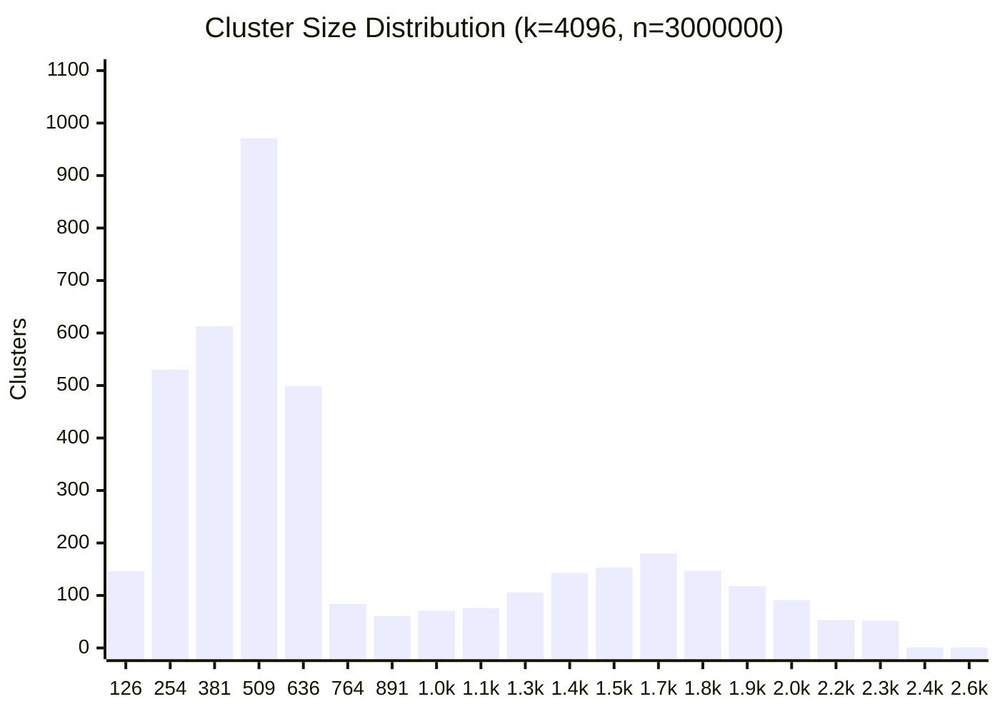

# Benchmark

Offline benchmark — normalize + `get_fraud_count` directly, no HTTP overhead, against all 54100 entries in the test dataset.

## Environment

| | |
|---|---|
| **CPU** | AMD Ryzen 7 7700X 8-Core Processor |
| **Cores / Threads** | 8 cores / 16 threads |
| **Max clock** | 5533 MHz |
| **L1d** | 32K |
| **L1i** | 32K |
| **L2**  | 1024K |
| **L3**  | 32768K |
| **Compiler** | GCC (Debian trixie-slim) |
| **Flags** | `-Ofast -march=haswell -mtune=haswell -flto` |
| **Pinned CPUs** | 0 |
| **CPU limit** | 0.37 cores (≈ Core i5-4260U @ 1.4 GHz single-thread) |

> Target hardware is a **Mac mini 2014 (Core i5-4260U, 1.4 GHz)**. The CPU throttle (0.37×) approximates its single-thread performance relative to this machine (~2.7× slower). Use these numbers to compare configs, not to predict absolute latency on the rinha.

## Dataset

| | |
|---|---|
| **Total** | 54100 |
| **Fraud** | 23959 (44.3%) |
| **Legit** | 30141 (55.7%) |
| **Edge cases** | 645 (1.2%) |
| **Borderline (detected)** | 11307 (20.9%) |

## Index

| | |
|---|---|
| **n** | 3000000 |
| **k** | 4096 |
| **train_sample** | 200000 |
| **train_iters** | 69/1000 (converged) |

### Cluster size distribution

> min=13  max=2550  avg=732.4


```mermaid
xychart-beta
    title "Cluster Size Distribution (k=4096, n=3000000)"
    x-axis ["126", "254", "381", "509", "636", "764", "891", "1.0k", "1.1k", "1.3k", "1.4k", "1.5k", "1.7k", "1.8k", "1.9k", "2.0k", "2.2k", "2.3k", "2.4k", "2.6k"]
    y-axis "Clusters" 0 --> 1100
    bar [146, 530, 613, 971, 499, 84, 61, 71, 76, 106, 143, 153, 180, 147, 118, 91, 53, 52, 1, 1]
```

## Results

> `approved = fraud_neighbors / 5 < 0.6` — threshold is fixed by the server.

| NP | NP.BORDER | R.MIN | R.MAX | avg (µs) | p50 (µs) | p99 (µs) | max (µs) | TP | TN | FP | FN | FP% | FN% |
|---|---|---|---|---|---|---|---|---|---|---|---|---|---|
| 1 | — | 1 | 4 | 11.07 | 3.73 | 9.58 | 63099.2 | 23953 | 30124 | 17 | 6 | 0.03% | 0.01% |
| 2 | — | 1 | 4 | 12.97 | 4.54 | 10.24 | 63104.6 | 23957 | 30137 | 4 | 2 | 0.01% | 0.00% |
| 3 | — | 1 | 4 | 16.13 | 5.40 | 11.45 | 63100.0 | 23959 | 30139 | 2 | 0 | 0.00% | 0.00% |
| **4** | **—** | **1** | **4** | **18.33** | **6.43** | **12.88** | **63090.4** | **23959** | **30141** | **0** | **0** | **0.00%** | **0.00%** |
| <span style="color:limegreen">**1**</span> | <span style="color:limegreen">**4**</span> | <span style="color:limegreen">**1**</span> | <span style="color:limegreen">**4**</span> | <span style="color:limegreen">**12.90**</span> | <span style="color:limegreen">**4.13**</span> | <span style="color:limegreen">**10.97**</span> | <span style="color:limegreen">**63078.6**</span> | <span style="color:limegreen">**23959**</span> | <span style="color:limegreen">**30141**</span> | <span style="color:limegreen">**0**</span> | <span style="color:limegreen">**0**</span> | <span style="color:limegreen">**0.00%**</span> | <span style="color:limegreen">**0.00%**</span> |
| **1** | **6** | **1** | **4** | **14.28** | **4.16** | **11.85** | **63086.6** | **23959** | **30141** | **0** | **0** | **0.00%** | **0.00%** |
| **1** | **8** | **1** | **4** | **13.21** | **4.09** | **13.03** | **63078.0** | **23959** | **30141** | **0** | **0** | **0.00%** | **0.00%** |
| **2** | **4** | **1** | **4** | **14.78** | **4.98** | **11.62** | **63060.2** | **23959** | **30141** | **0** | **0** | **0.00%** | **0.00%** |
| **2** | **6** | **1** | **4** | **14.96** | **4.99** | **12.29** | **62901.3** | **23959** | **30141** | **0** | **0** | **0.00%** | **0.00%** |
| **2** | **8** | **1** | **4** | **15.07** | **4.93** | **13.29** | **63093.1** | **23959** | **30141** | **0** | **0** | **0.00%** | **0.00%** |
| **3** | **4** | **1** | **4** | **16.60** | **5.75** | **12.57** | **63072.7** | **23959** | **30141** | **0** | **0** | **0.00%** | **0.00%** |
| **3** | **6** | **1** | **4** | **16.82** | **5.80** | **13.16** | **63127.1** | **23959** | **30141** | **0** | **0** | **0.00%** | **0.00%** |

## Running

```bash
make bench
```

To pin different CPUs, edit `cpuset` in `bench/docker-compose.yml`.
